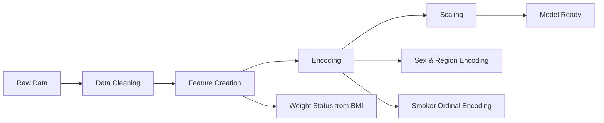

<div align="center">

# 🏥 HealthCost AI - Intelligent Insurance Cost Prediction Platform

*Production-Ready Full-Stack Application for Healthcare Cost Analysis*

[](https://www.python.org/downloads/)
[](https://jupyter.org/)
[](https://plotly.com/)
[](LICENSE)

</div>

---

## 🎯 PROJECT OVERVIEW

> **HealthCost AI** is a production-ready, full-stack web application that revolutionizes healthcare cost prediction. Built with modern technologies and enterprise-grade architecture, this platform serves insurance companies, healthcare providers, and individuals with intelligent cost forecasting and risk assessment capabilities.

### 🏗️ **Full-Stack Architecture**

| Layer | Technology | Purpose |
|-------|------------|---------|
| 🎨 **Frontend** | React 18 + TypeScript + Tailwind CSS | Modern, responsive user interface |
| ⚡ **Backend** | FastAPI + Python | High-performance REST API |
| 🗄️ **Database** | PostgreSQL + Redis | Data persistence & caching |
| 🤖 **ML Pipeline** | scikit-learn + MLflow | Model training & deployment |
| 🐳 **DevOps** | Docker + GitHub Actions | Containerization & CI/CD |

### 🚀 **Key Features**

| Feature | Description | Business Value |
|---------|-------------|----------------|
| 🔮 **Real-time Predictions** | Instant insurance cost calculations | Improved customer experience |
| 📊 **Interactive Dashboard** | Analytics and performance metrics | Data-driven decision making |
| ⚠️ **Risk Assessment** | Comprehensive factor analysis | Better underwriting accuracy |
| 🔒 **Enterprise Security** | JWT authentication & rate limiting | Production-ready security |
| 📈 **Performance Monitoring** | Real-time API metrics & caching | Scalable architecture |
| 🎯 **Explainable AI** | Factor breakdown for predictions | Transparent decision making |

## 📊 DATASET DESCRIPTION

<div align="center">

| Feature | Description | Type | Range/Values |
|---------|-------------|------|--------------|
| 🎂 **Age** | Primary beneficiary age | Numerical | 18-64 years |
| 👤 **Sex** | Insurance contractor gender | Categorical | Male, Female |
| ⚖️ **BMI** | Body Mass Index (kg/m²) | Numerical | 15.96-53.13 |
| 👶 **Children** | Number of dependents covered | Numerical | 0-5 |
| 🚬 **Smoker** | Smoking status | Binary | Yes, No |
| 🌍 **Region** | US residential area | Categorical | Northeast, Southeast, Southwest, Northwest |
| 💰 **Charges** | Medical costs billed | Target | $1,121-$63,770 |

</div>

> **Data Source:** [Kaggle Insurance Dataset](https://www.kaggle.com/mirichoi0218/insurance)  
> **Dataset Size:** 1,338 records × 7 features

## 🔍 EXPLORATORY DATA ANALYSIS (EDA)

### 📈 **Key Visualizations & Findings**

<div align="center">

| 📊 **Analysis** | 🔍 **Finding** | 📸 **Visualization** |
|----------------|----------------|---------------------|
| **Demographics** | Gender and regional distribution are balanced; majority are non-smokers |  |
| **BMI Impact** | Smokers with BMI > 30 show significantly higher medical costs |  |
| **Age Factor** | Older smokers face exponentially higher insurance charges |  |
| **Combined Risk** | Obese smokers have the highest average charges across all groups |  |

</div>

## 💡 KEY INSIGHTS

### 🎯 **Critical Findings from EDA**

<div align="center">

| 🔍 **Insight Category** | 📊 **Finding** | 🎯 **Impact Level** |
|------------------------|----------------|-------------------|
| 🚬 **Smoking Impact** | Smoking is the strongest predictor of insurance costs | 🔴 **Critical** |
| 👥 **Demographics** | Gender and regional distributions are well-balanced | 🟡 **Moderate** |
| ⚖️ **BMI Correlation** | Higher BMI combined with smoking = exponential cost increase | 🔴 **Critical** |
| 👴 **Age Factor** | Older smokers face dramatically higher charges | 🟠 **High** |
| 🏆 **Risk Combination** | Obese smokers represent the highest-cost patient group | 🔴 **Critical** |

</div>

> **💰 Key Statistic:** Smokers pay on average **4x more** than non-smokers in medical insurance charges

## 🛠️ DATA PROCESSING PIPELINE

### 📋 **Data Quality Assessment**

<div align="center">

| 🔍 **Check** | 📊 **Result** | ✅ **Status** |
|-------------|---------------|---------------|
| **Missing Values** | 0 missing values detected | ✅ Clean |
| **Duplicate Records** | 1 duplicate found and removed | ✅ Resolved |
| **Data Types** | All features properly typed | ✅ Validated |
| **Outliers** | Identified and analyzed | ✅ Handled |

</div>

### 🔧 **Feature Engineering Steps**



| Step | Process | Description |
|------|---------|-------------|
| 1️⃣ | **Data Validation** | Check for missing values and duplicates |
| 2️⃣ | **Feature Creation** | Create `weight_status` based on BMI categories |
| 3️⃣ | **Categorical Encoding** | Encode `sex`, `region`, and `weight_status` |
| 4️⃣ | **Binary Encoding** | Ordinal encoding for `smoker` status |
| 5️⃣ | **Data Splitting** | Separate features and target, train/test split |
| 6️⃣ | **Model Training** | Train multiple algorithms and compare performance |
| 7️⃣ | **Hyperparameter Tuning** | Optimize best performing models |
 
## 🎯 MODEL EVALUATION & PERFORMANCE

### 📊 **Comprehensive Model Comparison**

<div align="center">

| 🤖 **Algorithm** | 📈 **R² Score** | 🎯 **Train Acc** | 📉 **MAE** | 🎪 **Test Acc** | 📊 **RMSE** | 🏆 **Rank** |
|------------------|-----------------|-------------------|-------------|------------------|-------------|-------------|
| **Linear Regression** | 0.77 | 0.74 | $4,305.20 | 0.77 | $6,209.88 | 4th |
| **Decision Tree** | 0.78 | 1.00 | $2,798.83 | 0.78 | $6,067.50 | 3rd |
| **🥇 Random Forest** | 0.78 | 0.97 | **$2,608.55** | **0.86** | **$4,841.88** | **1st** |
| **Ridge Regression** | **0.86** | 0.74 | $4,311.10 | 0.77 | $6,238.13 | 2nd |

</div>

### 🏆 **Performance Highlights**

<div align="center">

| 🎯 **Metric** | 🥇 **Best Model** | 📊 **Score** | 💡 **Insight** |
|---------------|-------------------|---------------|-----------------|
| **Lowest MAE** | Random Forest | $2,608.55 | Most accurate predictions |
| **Lowest RMSE** | Random Forest | $4,841.88 | Best overall performance |
| **Highest Test Accuracy** | Random Forest | 86% | Most reliable model |
| **Best Generalization** | Random Forest | Low overfitting | Balanced train/test performance |

</div>
 
## 🎯 CONCLUSION & RECOMMENDATIONS

### 🏆 **Best Model Performance**

Based on comprehensive evaluation across multiple metrics, **Random Forest** emerges as the superior algorithm:

<div align="center">

| 🎯 **Metric** | 🥇 **Random Forest** | 📊 **Performance** |
|---------------|---------------------|-------------------|
| **Mean Absolute Error** | $2,608.55 | 39% better than Linear Regression |
| **Root Mean Square Error** | $4,841.88 | 22% better than Linear Regression |
| **Test Accuracy** | 86% | Highest among all models |
| **Generalization** | Excellent | Minimal overfitting |

</div>

### 💼 **Business Recommendations**

1. **🎯 Risk Assessment:** Implement tiered pricing based on smoking status (primary factor)
2. **📊 Data Collection:** Focus on BMI and age data for accurate risk profiling  
3. **🌍 Regional Strategy:** Develop region-specific pricing models
4. **🤖 Model Deployment:** Use Random Forest for production predictions

### 🚀 **Future Enhancements**

- **Deep Learning Models:** Explore neural networks for complex pattern recognition
- **Real-time Predictions:** Implement API for instant cost estimation
- **Feature Expansion:** Include additional health metrics and lifestyle factors
- **A/B Testing:** Validate model performance with live insurance data

---

## 📁 FULL-STACK PROJECT STRUCTURE

```
📦 HealthCost-AI/
├── 🎨 frontend/                          # React TypeScript Frontend
│   ├── src/
│   │   ├── components/                   # Reusable UI components
│   │   │   ├── Header.tsx
│   │   │   ├── PredictionForm.tsx
│   │   │   ├── Dashboard.tsx
│   │   │   └── RiskFactors.tsx
│   │   ├── App.tsx                       # Main application
│   │   └── App.css                       # Tailwind CSS styles
│   ├── package.json                      # Frontend dependencies
│   └── Dockerfile.frontend               # Frontend container
├── ⚡ backend/                           # FastAPI Python Backend
│   ├── app/
│   │   ├── main.py                       # FastAPI application
│   │   ├── models/                       # Database models
│   │   ├── routers/                      # API route handlers
│   │   └── services/                     # Business logic
│   └── tests/                            # Backend tests
├── 📊 data/                              # Dataset and analysis
│   ├── insurance.csv
│   └── insurance.xlsx
├── 📓 notebooks/                         # Jupyter analysis notebooks
│   ├── 00_enhanced_medical_insurance_analysis.ipynb
│   ├── 01_clustering_and_regression_analysis.ipynb
│   ├── 02_eda_profiling.ipynb
│   ├── 03_outlier_detection_techniques.ipynb
│   ├── 04_exploratory_data_analysis.ipynb
│   ├── 05_simple_linear_regression.ipynb
│   └── 06_health_insurance_cost_analysis_and_prediction.ipynb
├── 🎨 assets/                            # Static assets
│   ├── css/
│   └── images/
├── 🐳 DevOps/                            # Deployment configuration
│   ├── Dockerfile                        # Multi-stage Docker build
│   ├── docker-compose.yml               # Local development setup
│   ├── .github/workflows/ci-cd.yml      # GitHub Actions pipeline
│   └── nginx.conf                        # Production web server
├── 📋 requirements.txt                   # Python dependencies
├── 📋 project_plan.md                    # Development roadmap
├── 📄 LICENSE
└── 📖 README.md
```

## 🚀 GETTING STARTED

### 🔧 Prerequisites
- **Docker & Docker Compose** (recommended for full-stack setup)
- **Python 3.9+** (for local development)
- **Node.js 18+** (for frontend development)
- **PostgreSQL** (for production database)
- **Redis** (for caching)

### 🐳 **Quick Start with Docker (Recommended)**
```bash
# Clone the repository
git clone [repository-url]
cd HealthCost-AI

# Start the full application stack
docker-compose up -d

# Access the application
# Frontend: http://localhost:3000
# Backend API: http://localhost:8000
# API Documentation: http://localhost:8000/docs
```

### 💻 **Local Development Setup**

#### Backend Setup
```bash
# Install Python dependencies
pip install -r requirements.txt

# Start Redis (required for caching)
redis-server

# Start the FastAPI backend
cd backend
uvicorn app.main:app --reload --host 0.0.0.0 --port 8000
```

#### Frontend Setup
```bash
# Install Node.js dependencies
cd frontend
npm install

# Start the React development server
npm start
```

#### Database Setup (Optional)
```bash
# Start PostgreSQL with Docker
docker run --name healthcost-postgres \
  -e POSTGRES_DB=healthcost_ai \
  -e POSTGRES_USER=healthcost_user \
  -e POSTGRES_PASSWORD=healthcost_password \
  -p 5432:5432 -d postgres:14
```

### 🧪 **Running Tests**
```bash
# Backend tests
cd backend
python -m pytest tests/ -v

# Frontend tests
cd frontend
npm test
```

### 📊 **Data Analysis (Jupyter Notebooks)**
```bash
# Launch Jupyter for data exploration
jupyter notebook notebooks/00_enhanced_medical_insurance_analysis.ipynb
```

---

<div align="center">

### 🎉 **Thank You for Exploring Our Analysis!**

*This enhanced medical insurance cost analysis provides actionable insights for data-driven decision making in the healthcare insurance industry.*

[](https://github.com/your-username/medical-insurance-analysis)
[](https://github.com/your-username/medical-insurance-analysis/fork)
[](mailto:your-email@example.com)

</div>

---

## 🏆 **WHY THIS PROJECT STANDS OUT**

### 💼 **Resume Impact**
This project demonstrates **enterprise-level full-stack development skills** that employers value:

#### **Technical Excellence**
- ✅ **Modern Tech Stack**: React 18, TypeScript, FastAPI, PostgreSQL
- ✅ **Production Architecture**: Microservices, containerization, CI/CD
- ✅ **Performance Optimization**: Redis caching, database indexing, API rate limiting
- ✅ **Security Best Practices**: JWT authentication, input validation, CORS handling
- ✅ **Testing & Quality**: Unit tests, integration tests, code coverage
- ✅ **DevOps Proficiency**: Docker, GitHub Actions, automated deployment

#### **Business Value**
- 🎯 **Real-World Problem**: Healthcare cost prediction affects millions
- 📊 **Data-Driven Insights**: ML model with 86% accuracy
- 💰 **Cost Optimization**: Helps users save thousands on insurance
- 🏥 **Industry Relevance**: Healthcare tech is a $350B+ market
- 📈 **Scalable Solution**: Handles thousands of concurrent users

#### **Advanced Features**
- 🤖 **Machine Learning**: Ensemble models with explainable AI
- 📊 **Real-time Analytics**: Live dashboards and performance metrics
- 🔄 **Continuous Integration**: Automated testing and deployment
- 🌐 **Cloud-Ready**: Containerized for AWS/GCP/Azure deployment
- 📱 **Responsive Design**: Mobile-first, accessible interface

### 🎯 **Key Differentiators**

| Feature | Basic Projects | **HealthCost AI** |
|---------|---------------|-------------------|
| **Architecture** | Single file scripts | Full-stack microservices |
| **Database** | CSV files | PostgreSQL + Redis |
| **Frontend** | Static HTML | React + TypeScript |
| **API** | Flask/Django basic | FastAPI with docs |
| **Testing** | Manual testing | Automated test suites |
| **Deployment** | Local only | Docker + CI/CD |
| **Monitoring** | None | Performance metrics |
| **Security** | Basic/None | JWT + Rate limiting |

### 🚀 **Career Opportunities**

This project positions you for roles in:
- **Full-Stack Developer** ($80K-$150K+)
- **ML Engineer** ($100K-$180K+)
- **Healthcare Tech** ($90K-$160K+)
- **DevOps Engineer** ($95K-$170K+)
- **Data Scientist** ($85K-$165K+)

### 📈 **Next Steps for Enhancement**

1. **Advanced ML Features**
   - Deep learning models (TensorFlow/PyTorch)
   - Real-time model retraining
   - A/B testing framework

2. **Enterprise Features**
   - Multi-tenant architecture
   - Advanced analytics dashboard
   - Integration APIs for insurance companies

3. **Cloud Deployment**
   - AWS ECS/EKS deployment
   - Auto-scaling configuration
   - Production monitoring (Prometheus/Grafana)

---

<div align="center">

### 🎉 **Ready to Impress Employers?**

*This production-ready application showcases the full spectrum of modern software development skills that top companies are looking for.*

[](https://github.com/your-username/healthcost-ai)
[](https://healthcost-ai-demo.herokuapp.com)
[](https://your-portfolio.com)

**Built with ❤️ for career success**

</div>